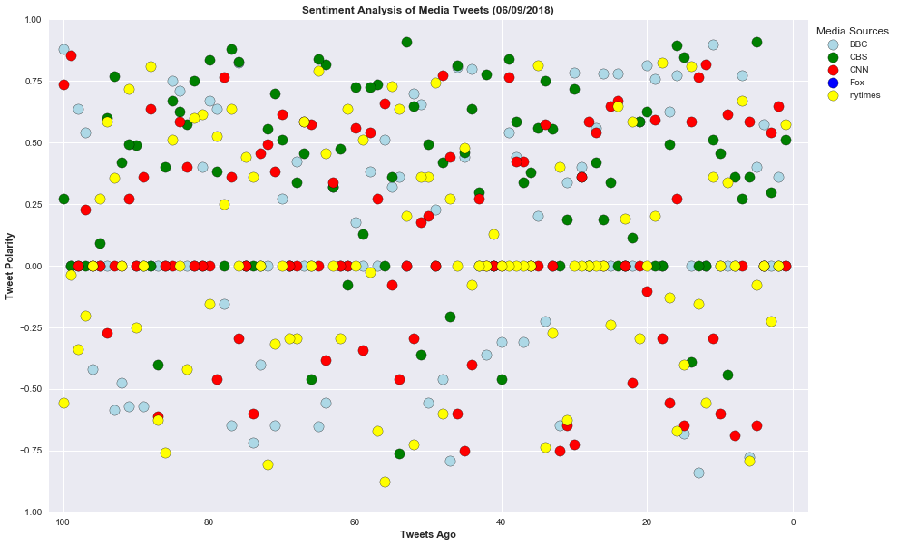
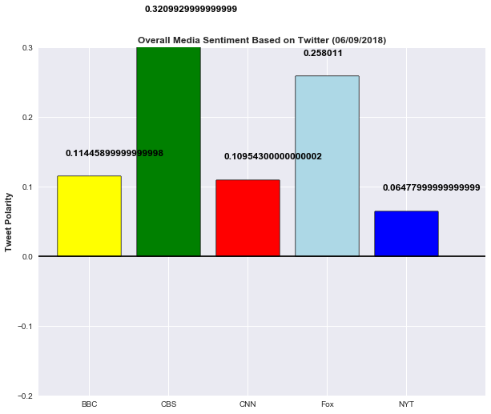

```python
#import dependencies
import pandas as pd
import numpy as np
import seaborn as sns
import matplotlib.pyplot as plt
import json
import time
import tweepy
from config import consumer_key, consumer_secret, access_token, access_token_secret
from vaderSentiment.vaderSentiment import SentimentIntensityAnalyzer
analyzer = SentimentIntensityAnalyzer()
```


```python
# Set up Tweepy API Authentication
auth = tweepy.OAuthHandler(consumer_key, consumer_secret)
auth.set_access_token(access_token, access_token_secret)
api = tweepy.API(auth, parser=tweepy.parsers.JSONParser())
```


```python
#Target Media search term
news_outline = ["@BBC", "@CBS", "CNN", "FOX", "@nytimes"]
counter = 1
sentiments =[]
```


```python
for outline in news_outline:
    public_tweets = api.user_timeline(outline, count=100)
    tweetnumber = 1       
    for tweet in public_tweets:
        print("Tweet %s: %s" % (counter, tweet["text"]))
        compound = analyzer.polarity_scores(tweet["text"])["compound"]
        pos = analyzer.polarity_scores(tweet["text"])["pos"]
        neu = analyzer.polarity_scores(tweet["text"])["neu"]
        neg = analyzer.polarity_scores(tweet["text"])["neg"]
        tweets_ago = tweetnumber
        sentiments.append({"Media Source": outline,
                           "Text":tweet["text"],
                           "Date": tweet["created_at"],
                           "Compound": compound,
                           "Positive": pos,
                           "Neutral": neu,
                           "Negative": neg,
                           "Tweet Count": tweetnumber})
        tweetnumber +=1
        counter +=1
```

    Tweet 1: Would you describe yourself as a feminist?
    #HearHer https://t.co/RZh8XfEria
    Tweet 2: What is it like being Germaine Greer? This observational documentary spends time with her and finds out.
    
    Germaine… https://t.co/YauZn2kit4
    Tweet 3: The cast of @QueerEye brought a bag of goodies along to @BBCR1's #BiggestWeekend 😍🎁
    
    Here's what @tanfrance,… https://t.co/c82OxTDXfI
    Tweet 4: One hundred years after some women won the right to vote, @ScarlettMoffatt tells the story of the suffragettes. https://t.co/B8gr3KbzkJ
    Tweet 5: A year on from the Grenfell Tower fire, Sean and his charity have been supporting children affected by the tragedy,… https://t.co/GXtypl36BW
    Tweet 6: One shocking day of sexual violence from the police altered the suffragettes' political strategy forever.… https://t.co/O1pfqAhXLa
    Tweet 7: ❤️️ This is what love looks like. https://t.co/Qle1eoBU5x
    Tweet 8: 😆 @ChanningTatum and @UsainBolt have all the moves.  
    #TheGNShow https://t.co/ry6TVJ6b6P
    Tweet 9: Fifty nations are now taking action to reduce plastic pollution, according to the biggest report so far from the… https://t.co/cz3KvhuKb4
    Tweet 10: RT @BBCNews: The Royal family watch the RAF flypast from Buckingham Palace. 23 aircraft are taking part to mark the Queen's official birthd…
    Tweet 11: Your friend that likes gin will LOVE this. #TopOfTheShop 😍 #WorldGinDay https://t.co/0y9sqjluRF
    Tweet 12: RT @BBCNews: The Trooping the Colour parade which marks the Queen's official birthday is underway in London. The Queen and Duke and Duchess…
    Tweet 13: 😂 Fashion sense v common sense: the battle rages on.
    
    Is the 'fanny pack shoe' an ugly fashion step too far?
    👉… https://t.co/WJ11O2gJxE
    Tweet 14: As football fans across the globe look forward to #Russia2018, @mrdanwalker looks back at England's World Cup-winni… https://t.co/3w7JJV7JwI
    Tweet 15: RT @bbcstories: Ever wondered why alcohol can seem to solve all our problems, but ends up making them even worse? This doctor’s explanation…
    Tweet 16: RT @BBCBreakfast: Yep, this is real... Russian hosts are being taught how to smile to make visitors feel welcome to the World Cup. 😁
    #BBCWo…
    Tweet 17: RT @bbcrb: Just amazing.
    The WHOLE community was invited to this Iftar meal. THOUSANDS turned up! 🙌🙌 https://t.co/WAOYvHIbx3
    Tweet 18: RT @bbccomedy: Dame Emma Thompson! ❤️ #QueensBirthdayHonours https://t.co/sGDU1GC3SU
    Tweet 19: RT @BBC6Music: Which riffs do you wish you had written?
    
    🤘 @st_vincent had some brilliant suggestions when she took over our Instagram toda…
    Tweet 20: RT @BBCArtsPR: Our very own @wmarybeard has received a damehood in the Queen's birthday honours list - congratulations Mary! @bbcarts @BBCF…
    Tweet 21: RT @bbcarts: Women across Britain raise banners for suffrage &amp; what it means to be a C21st woman. See selection of brilliant banners prior…
    Tweet 22: RT @BBCEngland: Britain's longest-serving poppy seller, 103-year-old Rosemary Powell, has been appointed an MBE in the Queen's birthday hon…
    Tweet 23: 🇬🇧 @huwbbc introduces live coverage of the military parade to mark the official birthday of HM the Queen. 
    
    Troopin… https://t.co/y1b6OpOoey
    Tweet 24: The charming and beautiful films of Lotte Reiniger, forgotten pioneer of animation. https://t.co/T2N7eLjHKh
    Tweet 25: 🎶 Tonight, @ArcticMonkeys perform live for @BBCR1 at the legendary Maida Vale studios.
    
    Artic Monkeys Live at the B… https://t.co/l8FI1nOTWY
    Tweet 26: 💃🕺 Why does dancing with our friends make us feel so good? https://t.co/iokI919nJp
    Tweet 27: 🎶🦈🚀🚗 From jazz-loving sharks to @elonmusk shooting his car into space: these are the 7 funniest news stories of the… https://t.co/TN5XaD9I0k
    Tweet 28: Leaving your responsibilities behind on a Friday like... 💁👋 #FridayFeeling @taylorswift13 https://t.co/wvmpzlOSel
    Tweet 29: 📺 From drama Succession to the return of @PoldarkTV, here are the TV shows worth watching in June. 
    👉… https://t.co/VFdghjNGmK
    Tweet 30: RT @bbcouch: We can announce today that Britain's Got Talent winner @LostVoiceGuy will be hosting our Storytelling Live event at @edfringe!…
    Tweet 31: RT @BBCEarth: We all have a part to play in protecting #OurBluePlanet.
    #WorldOceansDay 💙 https://t.co/1TM73iYPmA
    Tweet 32: 💔 US celebrity chef and television personality Anthony Bourdain has been found dead in his hotel room, aged 61.
    👉… https://t.co/55jBxSrdUS
    Tweet 33: The unexpected pioneering women of electronic music. https://t.co/ih6gK1Sz0y
    Tweet 34: Forget hygge, a new Nordic lifestyle trend called 'päntsdrunk' is all about drinking in your underwear. 👙🍻… https://t.co/SBTQBZ5E5e
    Tweet 35: RT @UKMoments: All-day Friday @BBC6Music will be playing an all-female playlist, spun by an all-woman DJ line up as part of the BBC's #Hear…
    Tweet 36: Pippa Middleton has confirmed she is expecting her first child with husband James Matthews. 
    https://t.co/4SiziX5Tix https://t.co/bFobAI2hBp
    Tweet 37: 'If the oceans don't stay healthy, human beings are doomed.' 
    #WorldOceansDay https://t.co/5aTLEHZ9Mi
    Tweet 38: RT @BBC6Music: This Friday, @St_Vincent takes over our Instagram (https://t.co/ui96YFYsuH) and offers some advice to improve your day. Here…
    Tweet 39: These ducklings jumping from their nest are absolutely adorable. 🦆🐣❤️️
    https://t.co/NlQijnt3hm
    Tweet 40: 🏙 We often think of cities as the least healthy places to live. But what does the research say?
    👉… https://t.co/gm4wRIFCQG
    Tweet 41: 🌊💙 A message from Sir David Attenborough for #WorldOceansDay. 
     https://t.co/778x4RMMRv
    Tweet 42: #OurGirl's Michelle Keegan discovers her great-great-grandmother was a suffragette, fighting for women to get the v… https://t.co/sNDxrleuGi
    Tweet 43: ❤️️ Harry has been wearing a Spider-Man mask during his radiotherapy to give him 'superpowers'. https://t.co/rsyOrCzD7k
    Tweet 44: Turns out even Shakespearean acting legends love a good chinwag. https://t.co/0DO0vG4uZg
    Tweet 45: RT @BBC6Music: 💪 Who do you hope to hear during our all-female #HearHer day from 5am-midnight on Friday?
    
    Backstage in Belfast we asked @fi…
    Tweet 46: This elderly man was struggling slowly across a busy road - but help was at hand! https://t.co/xfCtAOkL6F
    Tweet 47: 🐍 A Texan required 26 doses of anti-venom after he was bitten by the severed head of a rattlesnake he had killed.
    👉… https://t.co/zdD1aO7POz
    Tweet 48: RT @BBC_ARoadshow: 'We did it for all women' - 50 years after they walked out the Dagenham women say the fight for equal pay must go on #An…
    Tweet 49: 🎞🎬 From the Jurassic World sequel to an Oscar Wilde biopic, these films are worth making a trip to the cinema for t… https://t.co/PODFpM3UOq
    Tweet 50: 👊💕 If you've ever been touched by cancer, Julie's message will be important. 
    https://t.co/L7Ebn2c0Ed
    Tweet 51: RT @BBCEarth: Are you obsessed with the ocean? 🌊
    Do you go wild for whales? 🐋
    Want to share your passion for presenting with the world?
    Ent…
    Tweet 52: 💕🐮 Cow cuddling is the new wellness trend coming to a field near you and it's guaranteed to put you in a good moooo… https://t.co/8DJNABgCFc
    Tweet 53: Little girls don’t stay little forever. https://t.co/3yThJBbcUs
    Tweet 54: What it's like to find out you were adopted at age 49. https://t.co/Fl1LZJOMKZ
    Tweet 55: The original illustrated map of The Hundred Acre Wood is expected to fetch between £100,000 - £150,000 when it goes… https://t.co/FVle3m5MCh
    Tweet 56: ❤️🐶 Some heroes don't wear capes - they wear collars. https://t.co/0YF9EdnfL1
    Tweet 57: Tonight, award-winning writer Jeanette Winterson asks what we can learn from the Suffragette movement of a century… https://t.co/K9P2GuRy7X
    Tweet 58: Comedian @JordBrookes joins @SusanCalman for #MrsBrightside - her brand new podcast about mental health from the po… https://t.co/nIvQ5c2NNT
    Tweet 59: Tonight, #OurGirl actress @michkeegan uncovers some exceptional women on her family tree. 🙋💕
    
    Who Do You Think You… https://t.co/HDwdTyTqIw
    Tweet 60: No leaks (and better orgasms) - what you need to know about your pelvic floor. https://t.co/m8pGrbm71M
    Tweet 61: 74 years on from D-Day, these infrared photos show WW2 bunkers in new light. 📷 
    https://t.co/Dn2XKQ5jtZ https://t.co/Rqm91pIfj4
    Tweet 62: There are more than 110,000 gang members in Honduras and they're tearing the country apart. https://t.co/ZF9M0iAvzb
    Tweet 63: From a French novel about the Burundi genocide to a Chilean mystery: add these titles to your book shelf this month… https://t.co/T9AG8kvoPG
    Tweet 64: RT @BBC_ARoadshow: Fiona discovers more about suffragette Emily Wilding Davison, who died after throwing herself in front of the King's hor…
    Tweet 65: Ethan Hawke relives the time when one of his co-stars DIED on stage. #TheGNShow
    
    https://t.co/XIG2Y8OA7m
    Tweet 66: In 1993, Steven Spielberg's film Jurassic Park defined dinosaurs for an entire generation... but does it make scien… https://t.co/wLK4pyl9pv
    Tweet 67: RT @BBCSpringwatch: Ever heard a beatboxing starling? 🔊 🔊
    
    #Springwatch https://t.co/NC52eJ4MX0
    Tweet 68: RT @bbcthree: Madame Poole has been ballet dancing for an astounding seven decades. #HearHer https://t.co/X6ltLoANl7
    Tweet 69: RT @BBCFOUR: Here's a sneak preview of our brand new drama #Hidden. Starts Saturday, 9pm, @BBCFour. https://t.co/cibPD1hzr3 https://t.co/te…
    Tweet 70: When Mona began to lose her sight, her 84-year-old husband did something amazing for her... 💅💄❤️️
    
    https://t.co/Qle1eoBU5x
    Tweet 71: We're all familiar with that sinking, nagging feeling we get when we realise we have made the wrong choice. 😟
    
    But… https://t.co/NPYZY5U43f
    Tweet 72: 📻🐫🦅🐼🦈 @GregJames has got a new co-host!
    
    Sir David Attenborough becomes a @BBCR1 DJ at 5pm today... 
    
    https://t.co/zHHtjBZZ9v
    Tweet 73: 'The problem with plastic is that it never goes away. It doesn't decompose. It defies nature.' 
    #WorldEnvironmentDay https://t.co/Tkmj9qXzlK
    Tweet 74: #OurGirl is back and heading to Nigeria in the fight against terror. 
    
    Our Girl | 9pm | @BBCOne |… https://t.co/epbhcujexD
    Tweet 75: 👶🥦 If your child's a fussy eater, here are 5 tips from scientist @Dr_C_Llewellyn. https://t.co/MOhdgXa96t
    Tweet 76: RT @BBCTwo: Always wanted to pitch an idea to the stars of #DragonsDen? Well here’s your chance! Reply to this tweet with your best busines…
    Tweet 77: 💔 Fashion designer Kate Spade, 55, has been found dead in her New York apartment.
    👉 https://t.co/ku2uHiO0Nh https://t.co/sg40Mjbb12
    Tweet 78: ♻️🗑 These protesters want shops to take more responsibility for the overuse of plastic packaging.… https://t.co/C4YX62DYWU
    Tweet 79: ❤️😽 This man has vowed to be the best 'cat dad' he can be after finding random kittens under his bed. 
    👉… https://t.co/fWsKzfv8s3
    Tweet 80: 😂 These knitted Poldark dolls are the best!
    #TheGNShow https://t.co/Mpc1dWzojg
    Tweet 81: RT @BBC_ARoadshow: From artists to explorers, suffragettes to swimmers #antiquesroadshow discovers the pioneering women who have help shape…
    Tweet 82: How does plastic actually enter our oceans? 
    #WorldEnvironmentDay https://t.co/LdOt9inVFS
    Tweet 83: RT @BBCBreakfast: Have you got yours yet? #gingeremoji https://t.co/hKwIsLspYC
    Tweet 84: RT @bbcthree: 17-year-old Dillon upcycles clothes to help young homeless people feel confident going to school or for job interviews. https…
    Tweet 85: RT @BBCNews: "I was disabled before it was popular."
    
    @LostVoiceGuy - aka Lee Ridley - is the first comedian to win Britain's Got Talent.…
    Tweet 86: 🎨🙌 Middle-earth in colour: How Tolkien drew his fantasy universe.
    👉 https://t.co/z754byqVpR https://t.co/Jr6PnQWvIU
    Tweet 87: It's time to think about our plastic behaviour.
    #WorldEnvironmentDay https://t.co/kSzSawpYLv
    Tweet 88: Some of Arthur C Clarke's predictions about the future were bang on... https://t.co/6M7UJv6Mmh
    Tweet 89: 📎 The psychology of stealing office supplies. 
    👉 https://t.co/vfXaRVYcwU https://t.co/zoPWJRXVtO
    Tweet 90: 💤 Ever wondered what your brain is up to while you're dreaming? https://t.co/2JHc0lFKbS
    Tweet 91: Versailles is back! Tonight, Madame de Montespan finds out how to hurt a former friend...  
    
    #Versailles | 9pm |… https://t.co/5nEGyPoAp6
    Tweet 92: The story of a group of working-class women conducting a dangerous campaign for the vote.
    
    Suffragettes with… https://t.co/RKwQbGQMdu
    Tweet 93: The moment a dancing off-duty FBI agent drops his gun performing backflip and accidentally shoots man in leg. https://t.co/FIu2mCjlyP
    Tweet 94: 📸 From #Manhattanhenge to the world's largest freshwater pearl, here are some of the most striking news photos take… https://t.co/5Tp0s3MG7n
    Tweet 95: 🤷‍♀️😂 When @CubaGoodingJr took over @BBCBreakfast.
     https://t.co/XSPs0MOKoN
    Tweet 96: 🧔 Bearded men have been taking pictures of themselves from below and it's freaking people out...
    👉… https://t.co/FQ9t0swX2t
    Tweet 97: RT @bbcdoctorwho: Every episode of #DoctorWho since 2005 is now available to watch on @BBCiPlayer… Enjoy! https://t.co/uNWq307bei https://t…
    Tweet 98: ❤️ Ethan Hawke will be forever grateful to Robin Williams for helping launch his career.
    #TheGNShow https://t.co/uYMvKQvuev
    Tweet 99: Would you describe yourself as a feminist?
    
    #HearHer https://t.co/4UZzAu2IRO
    Tweet 100: RT @BBCSpringwatch: Surely this is the only way to react to chicks fledging?! 😂 We sure are excited here at #Springwatch HQ! 
    
    Thanks for c…
    Tweet 101: These two know a thing or two about awards! Watch them light up the stage tomorrow at the #TonyAwards. ✨ https://t.co/KHVZp65oLS
    Tweet 102: Here's everything you need to know before watching the #TonyAwards this Sunday at 8/7c: https://t.co/jcRgNGmLUZ https://t.co/8suUhVPFK6
    Tweet 103: Join @etnow's @DDirecto this Sunday on the #TonyAwards' red carpet. https://t.co/7jS8g10KmY
    Tweet 104: Here's @laChanze with a reminder that you can stream the #TonyAwards this Sunday on CBS All Access! https://t.co/8TDEXzKmyQ
    Tweet 105: We all get by with a little help from our friends, so what better way to celebrate #NationalBestFriendsDay than to… https://t.co/pIZezbBwaT
    Tweet 106: Get ready for show-stopping performances by the casts of the 2018 Tony-nominated shows Mean Girls, SpongeBob Square… https://t.co/NiSx9Bbw0F
    Tweet 107: Don’t miss a special performance from @springsteen this Sunday at the #TonyAwards: https://t.co/LYYdleaFwU https://t.co/IKkKoITH9y
    Tweet 108: RT @CBSThisMorning: .@SaraBareilles and @joshgroban are hosting this Sunday's @TheTonyAwards on @CBS! 
    
    Wednesday, they'll join us LIVE on…
    Tweet 109: RT @SU2C: SU2C telecast Co-Executive Producer Bradley Cooper sits down with Mitch Carbon, a pediatric cancer survivor who benefited from #S…
    Tweet 110: RT @StrangeAngel: About last night... The #StrangeAngel screening party was a blast! Pun intended. 🚀😏 https://t.co/m64EcNmweY
    Tweet 111: These CBS stars can really belt it out! Find out which celebs from your favorite shows are pitch-perfect:… https://t.co/X4zMACFazB
    Tweet 112: More stars are set to appear at the #TonyAwards, including @billyjoel, @amyschumer, and @katharinemcphee. See who e… https://t.co/lPUocBcn9t
    Tweet 113: The #TonyAwards are just days away, and @joshgroban and @SaraBareilles will bring all they've got to Broadway's Big… https://t.co/eKkWn6ClSq
    Tweet 114: Call us old-fashioned, but we donut want you missing out on #NationalDonutDay! Here are a few treats from us to you… https://t.co/HpzN8bQ3SO
    Tweet 115: Remember @Lin_Manuel’s beautiful sonnet from the 70th Annual Tony Awards®? Relive some of the greatest moments in… https://t.co/IZjeQLd58C
    Tweet 116: Good friends @joshgroban and @SaraBareilles are hosting the #TonyAwards together? Well, this is bound to be fun! https://t.co/26Vgzp0s2e
    Tweet 117: The #TonyAwards just got even better because @UzoAduba, @MattBomer, and more stars will be presenting live! Find ou… https://t.co/hfFBtWo1T9
    Tweet 118: Mark your calendars. @SalvationCBS returns Monday, June 25 at 9/8c! ☄️ https://t.co/N9pYuhYLRF
    Tweet 119: RT @thegoodfight: All episodes of season 2 are now available. Stream #TheGoodFight on CBS All Access: https://t.co/k3tn8kR9KC https://t.co/…
    Tweet 120: Get the popcorn ready! 🍿  It's going to be an unforgettable @survivorcbs finale. Make sure to tune in TONIGHT at 8/… https://t.co/vp0JyqfXMQ
    Tweet 121: RT @StrangeAngel: Every brilliant mind has a dark side. #StrangeAngel launches June 14, only on CBS All Access. https://t.co/y0MZg1BzEB htt…
    Tweet 122: Prepare yourself. The @NCIS_CBS season finale is unlike any other. Don't miss it TONIGHT at 8/7c. https://t.co/MOH6uiFc0C
    Tweet 123: Summer heats up with @CBSBigBrother, @SalvationCBS, and the brand-new competition series @TKOCBS. Find out when you… https://t.co/DxE7OnKs17
    Tweet 124: Who’s going to be watching the season finale of @ManWithAPlan tonight? RT if you'll be tuning in at 8:30/7:30c! https://t.co/ARLRtVuGuc
    Tweet 125: The season finale of @MadamSecretary will leave you speechless! Make sure to tune in tonight at 10/9c. https://t.co/hqxkLZsWpl
    Tweet 126: The @NCISLA season finale is going to be a wild ride. Don't miss all of the action starting TONIGHT at 8/7c! https://t.co/PNtUuVf9VQ
    Tweet 127: Retweet if you're ready for the #RoyalWedding! https://t.co/k57NM7OrXn
    Tweet 128: It's going down (literally) on the Season Finale of @HawaiiFive0CBS when a submarine appears off the coast of Waiki… https://t.co/oD7Le5XUz6
    Tweet 129: The #RoyalWedding is finally here, and you're invited! Join @CBSThisMorning’s @GayleKing and @etnow’s @KevinFrazier… https://t.co/Q5xiRkXLUz
    Tweet 130: When the @LifeInPiecesCBS season finale is back-to-back episodes. 👏 Get ready for double the laughs at 9/8c! https://t.co/SYW5UzXobv
    Tweet 131: Rules were made to be broken.💥 Don't miss the heart-pounding season finale of @swatcbs TONIGHT at 10/9c! https://t.co/NXLbeIrvcp
    Tweet 132: Is it fall yet? Check out the first looks at our new fall shows and stars from the CBS Upfront!
    
    https://t.co/l7GQVRzRFw
    Tweet 133: How many shows can you binge in a month? Find out with a 1 month free trial of CBS All Access! Use code STREAMITALL… https://t.co/yccQppCaxC
    Tweet 134: Save the dates! The CBS Fall lineup is here, and we're welcoming six new shows in addition to returning hits. Which… https://t.co/f9PSQfpHL7
    Tweet 135: What happens when the friendliest guy in the Midwest moves his family next door to a not-so-friendly new LA neighbo… https://t.co/KtEoNE3deL
    Tweet 136: When @MurphyBrownCBS returns to the news world, things sure won't be what they used to be! The revival of the groun… https://t.co/jJcgyqyDxL
    Tweet 137: When decorated former Navy SEAL Thomas Magnum returns home to Hawaii, he embarks on a new mission: solving cases in… https://t.co/6n2MWY3c2f
    Tweet 138: The ordinary turns extraordinary for this suburban couple when an exuberant young pop star unexpectedly moves in wi… https://t.co/9xaAUSm5nm
    Tweet 139: An outspoken atheist's life takes a surprising turn when he accepts a social media friend request from God! Watch w… https://t.co/EbVbL0SNDk
    Tweet 140: When danger threatens the nation, these elite agents risk their lives to keep it safe. Join them on the case when n… https://t.co/LuSY0jXBf9
    Tweet 141: Meet the new shows coming to CBS this fall!
    Tweet 142: So much TV to love! ❤️ Be sure to follow the shows of the CBS 2018-2019 primetime lineup and stay up-to-date on the… https://t.co/lQwGtznj5i
    Tweet 143: Every mission leaves its mark. Join us in the final mission to avenge Echo Team's deaths, tonight at 9/8c during th… https://t.co/SlfprTVDgD
    Tweet 144: Get ready for three new comedies, five new dramas and the return of the critically acclaimed @MurphyBrownCBS. Here'… https://t.co/alHwUTRFKh
    Tweet 145: RT @happytogether: When an international pop star moves into your house, life gets a little more interesting! @wayansjr, @AmberoniStevens a…
    Tweet 146: RT @TheNeighborhood: You can’t pick your neighbors, but Calvin sure wishes he could! @CedEntertainer stars in the new comedy #TheNeighborho…
    Tweet 147: Tonight's the night - Agent Dwayne Pride's fate will be revealed. Don't miss the special two-hour season finale of… https://t.co/52amkSiNcA
    Tweet 148: Donuts down, hands up! Get ready for a dramatic turn on the finale of @SuperiorDonuts TONIGHT at 9/8c. 🍩https://t.co/f5VSqOlRYu
    Tweet 149: RT @MagnumPICBS: Thomas Magnum is back on the case! @jay_hernandez stars in #MagnumPI, coming to #CBS. https://t.co/R1aURqMawD
    Tweet 150: RT @GodFriendedMe: You never know who's going to send you a friend request. #GodFriendedMe, the new drama series starring @hall_m_brandon a…
    Tweet 151: RT @TheRedLineCBS: Three Chicago families’ lives converge in the wake of a mistaken shooting. From acclaimed producers @ava and @GBerlanti…
    Tweet 152: RT @FamCBS: No family is perfect, especially this #FAM! @ninadobrev, @toneBell and @odessaadlon star in the new #CBS comedy #FAM. https://t…
    Tweet 153: RT @TheCodeCBS: Their code is honor, courage and commitment. They pursue military justice at home and abroad. #TheCode coming to #CBS. http…
    Tweet 154: RT @FBICBS: Meet the FBI agents who are investigating the most dangerous cases threatening our nation. From Emmy Winner Dick Wolf and the t…
    Tweet 155: RT @MurphyBrownCBS: The ground-breaking comedy returns. #MurphyBrown coming to #CBS. https://t.co/di8GXoVPjh
    Tweet 156: RT @StrangeAngel: Play with fire. 🔥 #StrangeAngel launches June 14 on #CBSAllAccess. https://t.co/xiFSkVz1vB https://t.co/Aw3kGeHyj4
    Tweet 157: Happy #MothersDay to the moms who comfort us, understand us, and keep us centered. We ❤️ you. https://t.co/4YDmZrTGIC
    Tweet 158: The more the merrier! CBS has ordered five more shows that just might become your new favorites next season:… https://t.co/2g5OSj2xPu
    Tweet 159: Thinking about the @BlueBloods_CBS season finale like… Don’t miss the surprising reveal TONIGHT at 10/9c. https://t.co/8ExkPFpnFj
    Tweet 160: Double the @MomCBS, double the fun! Anyone else feel like they hit the jackpot with the back-to-back Season Finale… https://t.co/ebq8WJLKGf
    Tweet 161: 2 suitors, 1 Meemaw and 1 Sheldon. You won’t want to miss the season finale of @YoungSheldon tonight at 8:30/7:30c. https://t.co/Hht2yRE7ly
    Tweet 162: Broadway's Biggest Night is around the corner! Who are you hoping to see? #TonyAwards2018 ✨ https://t.co/KLT8QCxWcK
    Tweet 163: The big day is finally here, and you’re invited. 👰 Make sure to tune in to the @bigbangtheory’s star-studded #ShAmy… https://t.co/la9E6tvQ5b
    Tweet 164: Before the #ShAmy wedding tomorrow, the @bigbangtheory stars &amp; special guests play a game of "yay or nay" with thes… https://t.co/ZpCM16qOyT
    Tweet 165: Get ready for more laughs! Learn more about the two new comedies coming to CBS: https://t.co/cpT3fd2RH5 https://t.co/NGrcp803zW
    Tweet 166: Goodbyes are never easy.  After 15 seasons, don’t miss Abby’s final episode of @NCIS_CBS tonight at 8/7c.  https://t.co/GTGj2YRJA1
    Tweet 167: Will you be watching the @BullCBS Season 2 Finale tonight at 9/8c? RT if your answer is yes! https://t.co/OxnyEDVsKj
    Tweet 168: RT @thegoodfight: Listening to #QueenBaranski read fan tweets is like poetry. 😍 Warning: this video will give you ALL the feels. ☺️❤️ #TheG…
    Tweet 169: RT @KevinCanWaitCBS: Season 2 of #KevinCanWait comes to a close tonight, and @KevinJames and @LeahRemini have A LOT to say about it. https:…
    Tweet 170: Spend your Friday night with this dynamic duo! Tune in to the season finale of @MacGyverCBS at 8/7c on CBS and CBS… https://t.co/AfWUVo4GSu
    Tweet 171: RT @undercover_cbs: Get ready for the series premiere of #CelebrityBoss in just seven days! How would you react if your favorite celebrity…
    Tweet 172: The force is strong on the set of @bigbangtheory! #MayThe4thBeWithYou https://t.co/uYyXKtuVCM
    Tweet 173: RT @thegoodfight: The fight's not over yet. #TheGoodFight is renewed for Season 3. https://t.co/gUrDeA5KQP
    Tweet 174: RT @TKOCBS: Both @hwventure and @janemun have been named Executive Producers and showrunners of #TKO: TOTAL KNOCK OUT! Learn more about the…
    Tweet 175: RT @StrangeAngel: Sex. Magick. Rocket Science. #StrangeAngel launches June 14, only on CBS All Access. https://t.co/I3sqWMASxl https://t.co…
    Tweet 176: Broadway's Biggest Night will honor the best in theatre on Sunday, June 10! Here are the nominees for the… https://t.co/tCiNaLGIvq
    Tweet 177: We congratulate all of our CBS #DaytimeEmmy Award winners! Check out the stars who joined @TheTalkCBS hosts to cele… https://t.co/JfUFINmYGH
    Tweet 178: RT @KevinJames: Getting the band back together @AdamSandler @chrisrock @MikeDelguidice1 @KevinCanWaitCBS #KevinCanWait https://t.co/Mo5EWck…
    Tweet 179: See all of the stunning fashion looks from the @CBSDaytime stars on the #DaytimeEmmys red carpet:… https://t.co/iJN1ssGPvZ
    Tweet 180: The 45th annual #DaytimeEmmys are here! Congratulations to all of the wonderful @CBSDaytime stars and shows nominat… https://t.co/xZhDSYnxL6
    Tweet 181: These stars are going undercover for #CelebrityBoss! Find out more about Celebrity @undercover_cbs premiering May 1… https://t.co/Deyn76ADT9
    Tweet 182: New courage. New hope. New season. 
    
    Season 3 of @CodeBlackCBS premieres TONIGHT at 10/9c on CBS! https://t.co/rR8xUCKlzI
    Tweet 183: Celebrate #DNADay by letting your forensic flag fly and revisit some classic episodes of @CSI_CBS on CBS All Access… https://t.co/YCbHDK2r4b
    Tweet 184: Get ready for big reveals, dramatic conclusions, and huge guest stars! Find out more about the 2017-2018 season fin… https://t.co/xcBChnjEvH
    Tweet 185: Who’s ready to see these moves? 🕺 Tune in to the @latelateshow’s Carpool Karaoke Primetime Special TONIGHT at 10/9c! https://t.co/gjrURqXaPN
    Tweet 186: The 53rd #ACMawards turned into one big party when @KeithUrban and @juliamichaels performed their upbeat single "Co… https://t.co/Q3Zj3EzuNs
    Tweet 187: A blind date was all it took. Learn more about Meghan Markle and her road to royalty from the people who know her b… https://t.co/fEAMUblPQ4
    Tweet 188: RT @carrieunderwood: ICYMI! Watch Carrie’s performance of #CryPretty from the #ACMawards below! -TeamCU https://t.co/T9I3ko2xFu
    Tweet 189: There's a new addition to the cast of the upcoming revival of Murphy Brown!  Learn more about Tyne Daly's character… https://t.co/ijSXSLyDaR
    Tweet 190: Country superstar @LukeBryanOnline delivers his moving anthem "Most People Are Good" at the 53rd #ACMawards:… https://t.co/GhhAsEDqmq
    Tweet 191: Coming to CBS All Access June 14, #StrangeAngel is inspired by the real life story of Jack Parsons and explores the… https://t.co/IsPrXRNXye
    Tweet 192: When you realize there are TWO episodes of @CrimMinds_CBS tonight! 👏 Who’s ready for the double-episode season fina… https://t.co/CWVAHHeIGr
    Tweet 193: Giving you even more reasons to celebrate! 🎉 See which CBS series are back for another year: https://t.co/O2LI0eJXTA https://t.co/H436kL1jSK
    Tweet 194: Watch country star @blakeshelton belt out his beautiful ballad "I Lived It" at the 53rd #AMCawards:… https://t.co/w0WRmpQ6fk
    Tweet 195: RT @joshgroban: I AM SO HAPPY I COULD CRY BUT ITS MIDNIGHT IN JAPAN SO I WILL SLEEP BUT ‼️‼️‼️‼️👫🏆🎭😭🔜 #TonyAwards2018 https://t.co/NLss47K6…
    Tweet 196: Broadway stars @SaraBareilles and @joshgroban will host @TheTonyAwards on June 10! Hear how these multi-talented ar… https://t.co/jy52FKd7t0
    Tweet 197: Can you believe it’s been 11 years since @taylorswift13’s first-ever performance at the #ACMawards?! Look back at t… https://t.co/QHSPuJLLFb
    Tweet 198: Waiting for the @ScorpionCBS season finale to start like… Tune in at 10/9c! https://t.co/peoDXtO707
    Tweet 199: Cast your vote! #ACMawards https://t.co/57ZN5gr6Y1
    Tweet 200: RT @CBSTweet: #CBSRatingsNews: #ACMawards Dominate on #CBS.  Over 12 million Total Viewers.  +11% year to year increase!  Biggest audience…
    Tweet 201: The week began with news of Trump canceling the Philadelphia Eagles' visit to the White House, and ended with news… https://t.co/RnTSl1biuW
    Tweet 202: President Trump says his relationships with other Western leaders are perfect, but the truth is the transatlantic a… https://t.co/SRmvcifksG
    Tweet 203: President Trump on the upcoming North Korea meeting: “I really feel confident. I feel that Kim Jong Un wants to do… https://t.co/LYZrSETumR
    Tweet 204: RT @cnnbrk: After Trump reversed his position on a G7 statement, Sen. McCain said to US allies: "Americans stand with you, even if our Pres…
    Tweet 205: News of Anthony Bourdain’s death shook people around the world. We asked for your stories of how this gifted storyt… https://t.co/FBT6PiNiuT
    Tweet 206: One step on the island of Bermuda, and it's impossible not to be moved by its beauty, history, simplicity and charm… https://t.co/EFfFTW85e1
    Tweet 207: As the millions of US children diagnosed with ADHD move into adulthood, more and more are wondering whether to cont… https://t.co/KyyWswuJUN
    Tweet 208: President Trump calls Canadian Prime Minister Justin Trudeau "very dishonest and weak," accusing him of making "fal… https://t.co/fj0JucTrXy
    Tweet 209: Does a pharmacy have an obligation to help a patient be sure that insurance will cover a prescription?
    
    That's the… https://t.co/luJqdfSzRj
    Tweet 210: Construction workers in the UK have found wads of cash dating back to World War II at a shop that once belonged to… https://t.co/wYZnzHjRli
    Tweet 211: Charles Krauthammer, the famed conservative columnist, informed readers that he is confronting an aggressive form o… https://t.co/xEzj6dMTcl
    Tweet 212: BREAKING: Justify wins the 150th running of the Belmont Stakes to win horse racing’s 13th Triple Crown https://t.co/TUE8Wwe8FS
    Tweet 213: The race to save the Great Barrier Reef? A coral fertility treatment designed to help damaged parts of the reef is… https://t.co/3nTj0nA5h9
    Tweet 214: Tyler Soloman wiped tears of joy off his face after his father, who'd been deployed overseas, surprised Tyler by sh… https://t.co/8rub7aG2Ej
    Tweet 215: News of Anthony Bourdain’s death shook people around the world. We asked for your stories of how this gifted storyt… https://t.co/YYJPIxu1zN
    Tweet 216: First responders in Russellville, Arkansas, went above and beyond the call of duty to surprise a teen with autism a… https://t.co/h96qLLu7qu
    Tweet 217: Danny Kirwan, a guitarist who appeared on five of Fleetwood Mac's albums, died in London on Friday, according to th… https://t.co/KUwHtJ6ins
    Tweet 218: JUST IN: Canadian Prime Minister Justin Trudeau says he will impose retaliatory measures to answer President Trump'… https://t.co/AiVDwmzMvV
    Tweet 219: Her rare skin condition keeps her indoors, but she braved the sun to walk at graduation https://t.co/ZkdCAXZwUE https://t.co/k6YeRZ6lI0
    Tweet 220: An internal Census Bureau memo sent to Commerce Secretary Wilbur Ross warns that adding a citizenship question to t… https://t.co/0AZC4nYfN2
    Tweet 221: Secretary of State Mike Pompeo reiterated US calls for North Korea to completely rid itself of all remnants of its… https://t.co/3RxJpEMn3K
    Tweet 222: Syracuse University has suspended 15 members of a professional fraternity after they appeared in videos that the sc… https://t.co/X6Bs6DkczE
    Tweet 223: Porsche's first electric car will be called the Taycan https://t.co/Wxy5sh45nm https://t.co/3m7qXCcg2J
    Tweet 224: There was nobody like Anthony Bourdain, and there was no show like #PartsUnknown. CNN pays tribute with a special n… https://t.co/9TgJMgP7Kc
    Tweet 225: President Trump says his relationships with other Western leaders are perfect, but the truth is the transatlantic a… https://t.co/o0UsVXeClf
    Tweet 226: Prince Harry and Meghan, Duchess of Sussex, joined celebrations of Queen Elizabeth II's official birthday with the… https://t.co/c6kvYJ2vwn
    Tweet 227: President Trump on the upcoming North Korea meeting: “I really feel confident. I feel that Kim Jong Un wants to do… https://t.co/9jM2GjrhxU
    Tweet 228: One step on the island of Bermuda, and it's impossible not to be moved by its beauty, history, simplicity and charm… https://t.co/EOxmxM76Kk
    Tweet 229: Will we ever fly like the Jetsons? This company just unveiled its first commercial flying car, Flyer — and… https://t.co/bZV351RYJz
    Tweet 230: A man in Texas nearly died after the severed head of a rattlesnake bit him https://t.co/bqHnciUgf3 https://t.co/NmnJLHs3Hz
    Tweet 231: News of Anthony Bourdain’s death shook people around the world. We asked for your stories of how this gifted storyt… https://t.co/lzZyRpT9Co
    Tweet 232: Authorities have found the remains of a woman killed by an alligator in Davie, Florida. The woman disappeared Frida… https://t.co/MlDdA6jk5h
    Tweet 233: The small (but not insignificant) ways Anthony Bourdain made a difference in the lives of some everyday people… https://t.co/TMK8f9nYfC
    Tweet 234: In the history of horse racing, only 12 horses have ever won the fabled Triple Crown. But why is this trophy so dif… https://t.co/gDu0o6AgPX
    Tweet 235: President Trump, while making remarks at the G7 summit, says he has not spoken to Vladimir Putin in "quite a while,… https://t.co/4qmAImsiL4
    Tweet 236: This computer can do more calculations per second than the world's population could do in a year… https://t.co/wqlDQvYF3L
    Tweet 237: At the G7 meeting, President Trump called for an end to tariffs and scolded other countries for using the United St… https://t.co/KG7SFGii09
    Tweet 238: BlackBerry still hopes its keyboard keeps fans coming back https://t.co/AodQi1CBVV https://t.co/8KbIHW3k74
    Tweet 239: The race to save the Great Barrier Reef? A coral fertility treatment designed to help damaged parts of the reef is… https://t.co/MD6vhMxOh8
    Tweet 240: What is a tariff? Your trade questions, answered https://t.co/AIJVEEOzHM https://t.co/HT5UJDzzjl
    Tweet 241: A Sikh soldier wore a turban in Queen Elizabeth ll's official birthday parade https://t.co/LK0fihnFB2 https://t.co/142baFgcVA
    Tweet 242: A former diplomat at the Vatican Embassy in Washington has been indicted by a Vatican court for possession of child… https://t.co/CSRKlOzeg8
    Tweet 243: Simona Halep wins first grand slam title by beating Sloane Stephens at the French Open https://t.co/0tMJbvB40e https://t.co/s3YRroOgXu
    Tweet 244: President Trump doubles down on his call for Russia to be readmitted into the G7 and blames former President Obama… https://t.co/3zkWB92wwY
    Tweet 245: The Trump administration's latest attack on Obamacare would gut protections for the sick https://t.co/ikBcCkGeAT https://t.co/ehXI4vF0vc
    Tweet 246: Construction workers in the UK have found wads of cash dating back to World War II at a shop that once belonged to… https://t.co/Zuo9XcYf9a
    Tweet 247: Anthony Bourdain's fans turned the restaurant where he shot to fame as a chef into a memorial, leaving roses and no… https://t.co/5fg9y1cERL
    Tweet 248: Hall of Fame trainer Bob Baffert, who is looking to make history with a win today at the Belmont Stakes, compares h… https://t.co/sUsVNh98tA
    Tweet 249: The week began with news of Trump canceling the Philadelphia Eagles' visit to the White House, and ended with news… https://t.co/H1ILtBxF1W
    Tweet 250: Illinois Republicans in Congress are making an urgent plea to President Trump: Don't let Rod Blagojevich off the ho… https://t.co/L4UPCaV1kD
    Tweet 251: Former Trump campaign chairman Paul Manafort and his attorneys struck back at special counsel Robert Mueller's char… https://t.co/m4eIhVUiWL
    Tweet 252: Charles Krauthammer, the famed conservative columnist, informed readers that he is confronting an aggressive form o… https://t.co/7vTbQ8M6D8
    Tweet 253: Prince Harry and Meghan, Duchess of Sussex, joined celebrations of Queen Elizabeth II's official birthday with the… https://t.co/UkiwKzYsxC
    Tweet 254: Republicans haven't won statewide in Virginia since 2009. Tuesday's Senate primary shows why:… https://t.co/xkWpPfkUCE
    Tweet 255: President Trump says he thinks he’ll know “within the first minute” if North Korea is serious about peace… https://t.co/kRdFefn4fN
    Tweet 256: RT @CNNPolitics: Trump: "I think it would be asset to have Russia back in. I think it would be good for the world. I think it would be good…
    Tweet 257: "Consumer Financial Protection Bureau acting director Mick Mulvaney has ousted a committed group of experts who vol… https://t.co/l36frkFEtw
    Tweet 258: President Trump on the upcoming North Korea meeting: “I really feel confident. I feel that Kim Jong Un wants to do… https://t.co/D0Fi57k3zj
    Tweet 259: Things don't look good for Dodge and Chrysler https://t.co/twYdKzCpZ4 https://t.co/9aKZvGnuQG
    Tweet 260: President Trump: Trade was "at the top of the list" at G7 discussions because "the United States has been taken adv… https://t.co/u6247HzPsj
    Tweet 261: President Trump is speaking at the G7 before heading to Singapore for the summit with Kim Jong Un. Watch live on CN… https://t.co/dNYLQOvVEk
    Tweet 262: President Trump is planning to depart the G7 ahead of climate change talks https://t.co/bfFqMKTIrg https://t.co/6PkzSs4guA
    Tweet 263: Former President Obama says he’ll always remember the meal he shared with Anthony Bourdain in Vietnam: “He taught u… https://t.co/XI67jcoy55
    Tweet 264: President Trump's tariffs on steel and aluminum threaten America's booming RV industry https://t.co/FxOEFN6Sx2 https://t.co/zpDj0uGxRI
    Tweet 265: What is a tariff? Your trade questions, answered https://t.co/8Fylq20zXj https://t.co/pSfQJhAnZR
    Tweet 266: The Duke and Duchess of Sussex celebrate Queen Elizabeth II's official birthday with the traditional Trooping the C… https://t.co/L2o8IJcNej
    Tweet 267: One step on the island of Bermuda, and it's impossible not to be moved by its beauty, history, simplicity and charm… https://t.co/mPpGOqifbk
    Tweet 268: As the millions of US children diagnosed with ADHD move into adulthood, more and more are wondering whether to cont… https://t.co/Qs5xlj8fwK
    Tweet 269: Fans around the world mourn chef and storyteller Anthony Bourdain, sharing memories of how his travels, food and co… https://t.co/jiW8HhY9ia
    Tweet 270: Does a pharmacy have an obligation to help a patient be sure that insurance will cover a prescription?
    
    That's the… https://t.co/2Jxsnx7cI0
    Tweet 271: Twitter has had a stunning turnaround https://t.co/hzutT84IrC https://t.co/AK7R50K5mh
    Tweet 272: IHOP says it's changing name to IHOb. Many major companies also have rebranded — some successfully and some not so… https://t.co/Xz5NjtpaqH
    Tweet 273: Mars is suddenly more interesting | By Jonathan Lunine via @CNNOpinion https://t.co/EA2ETHIldR https://t.co/fgmZax7nwV
    Tweet 274: Construction workers in the UK have found wads of cash dating back to World War II at a shop that once belonged to… https://t.co/TYdsjSziK7
    Tweet 275: During her commencement address to the MIT Class of 2018, Facebook COO Sheryl Sandberg spoke candidly about Faceboo… https://t.co/hznkJTzAPH
    Tweet 276: Charles Krauthammer, the famed conservative columnist, informed readers that he is confronting an aggressive form o… https://t.co/H6R3LykoER
    Tweet 277: Will we ever fly like the Jetsons? This company just unveiled its first commercial flying car, Flyer — and… https://t.co/uRJsH7yPmG
    Tweet 278: The race to save the Great Barrier Reef? A coral fertility treatment designed to help damaged parts of the reef is… https://t.co/AGpnS1dn0C
    Tweet 279: Organizers of a fashion show in Saudi Arabia used drones to display female clothes, drawing ridicule on social medi… https://t.co/cgo5HTjIJd
    Tweet 280: From delivery to aviation, Dubai is at the forefront of drone experimentation. Here's a look at what the future hol… https://t.co/IZMve8IRLb
    Tweet 281: Are windowless planes the future of travel? https://t.co/Fjc2m6WgtG https://t.co/ux29QpKXWA
    Tweet 282: Hurricanes and tropical storms are moving more slowly around the planet, resulting in higher rainfall and more extr… https://t.co/8qyqjq9IGd
    Tweet 283: The Afghan Taliban called for a three-day ceasefire with Afghan forces over the Eid al-Fitr holiday, a move that fo… https://t.co/BLmTAtjmRg
    Tweet 284: Tyler Soloman wiped tears of joy off his face after his father, who'd been deployed overseas, surprised Tyler by sh… https://t.co/uzD0GNZH2P
    Tweet 285: Penguins, Seals, and Krill: Antarctica's fragile food chain | via @CNNVR https://t.co/1BBRFfOzWk https://t.co/G46D0CB0wY
    Tweet 286: Anthony Bourdain's life in pictures https://t.co/76sjWPlMRR https://t.co/MtFAqaoDvC
    Tweet 287: The US Embassy in Mozambique has warned of "imminent attacks" against government and commercial centers in a northe… https://t.co/EoDJsFFoOM
    Tweet 288: Egypt is building The Grand Egyptian Museum. The cost? More than $1 billion. It will re-house and restore some of t… https://t.co/R5c8mOlfrv
    Tweet 289: The Justice Department won't defend the Deferred Action for Childhood Arrivals program in a federal lawsuit that Te… https://t.co/0IJPEuEAF0
    Tweet 290: President Trump is dressed as a king on the new Time magazine cover https://t.co/7pFcAHVSIF https://t.co/joUPfVBvUY
    Tweet 291: First responders in Russellville, Arkansas, went above and beyond the call of duty to surprise a teen with autism a… https://t.co/QtTP3JEFVL
    Tweet 292: The world's highest glass bridge will soon be home to the world's highest bungee jump https://t.co/fAaotSRizW via… https://t.co/t4WbdUBMFL
    Tweet 293: Steamboat Geyser in Yellowstone National Park is erupting unusually often. One June 4, the geyser had its eighth er… https://t.co/kzJPr5HFmj
    Tweet 294: Researchers are looking into the possibility of using blood tests to predict a woman's risk of premature birth, whi… https://t.co/vJZFkJZz7U
    Tweet 295: Watch these homes being built using a 3D printer https://t.co/igaBP4k4F8 https://t.co/cpQ97vRD2k
    Tweet 296: KFC says it will break with its meat-loving tradition and begin testing a vegetarian alternative to chicken later t… https://t.co/WfVJGm649F
    Tweet 297: This Army soldier traveled from Iraq for his daughter’s graduation and surprised her at the rehearsal… https://t.co/5UKjPCDo5W
    Tweet 298: This is the poem a kindergarten teacher hung up so her students know what to do in a school shooting… https://t.co/Tf587ohFnZ
    Tweet 299: Ever felt like your vacation would make a good blockbuster movie? This tour company aims to capture your travel exp… https://t.co/DsmmE2rdJx
    Tweet 300: This delivery man is being praised for taking a welcome mat's quirky instructions literally https://t.co/JTIKQxzCvS https://t.co/rZCmomGUOb
    Tweet 301: @justkelly_ok @dmakogon @kcunning Good on him screaming into his echo chamber of privileged tech bros. He knows wel… https://t.co/9bVtfvGF9S
    Tweet 302: @DanNutter_ @SiAdcock yep, I used to feel obliged/compelled/trapped in answering. these days it’s straight to archi… https://t.co/T0WXQHwHCU
    Tweet 303: RT @alicegoldfuss: Since market supply of women in tech is low, I demand to be treated and priced like the artisanal, hand-crafted, locally…
    Tweet 304: @justkelly_ok @alicegoldfuss Basically 😂
    Tweet 305: @justkelly_ok @alicegoldfuss He’s been like this since I met him 6-7 years ago so I doubt anything will make him re… https://t.co/HiznWHg60v
    Tweet 306: RT @polotek: There is no hidden boogieman that's ruining diversity. It's just us. Me and you. So if I'm talking about changing things and y…
    Tweet 307: A quote from today’s email following that scheme. Seems like underrepresented groups need air quotes. And pay inequ… https://t.co/LQFN3dfChW
    Tweet 308: Anatomy 80% of emails I get from men I don’t know with more or less ambiguous subjects (like “hi”):
    
    1) I have read… https://t.co/fGlw52IhwC
    Tweet 309: @cabel This is an intervention Cabel
    Tweet 310: RT @Candice_MMorgan: Please, please be responsible in reporting these tragic losses. For those struggling, and for the survivors reliving p…
    Tweet 311: RT @laurenduca: Reach out to someone you care about who might be struggling today. Remind them that they have a place in your heart. Ask ho…
    Tweet 312: @ohhoe I mean, white men are never wrong so it’s obviously misinterpreted and we live in a meritocracy.
    
    (also, yeah, a known offender.)
    Tweet 313: RT @presentcorrect: 'Your body is not a temple, it's an amusement park. Enjoy the ride.” 
    
    Anthony Bourdain
    Tweet 314: RT @abcnews: @CNN If you or anyone you know needs help:
    Lifeline on 13 11 14
    Suicide Call Back Service on 1300 659 467
    Beyond Blue on 1300…
    Tweet 315: [cw: suicide]
    
    Just a few days after news about Kate Spade broke, Anthony Bourdain is no longer with us. I will kee… https://t.co/QDWnf7l2rA
    Tweet 316: RT @soniagupta504: I wish people celebrated Blackness the way they celebrate LGBTQ pride, or women's issues. It seems insulting at this poi…
    Tweet 317: A short and sweet intro to `position: sticky`, a great alternative to JavaScript-reliant parallaxes that often lead… https://t.co/9qncwTQ5wa
    Tweet 318: @jstn hope you get some rest and peace of mind. I know how debilitating anxiety can be. 
    
    💖
    Tweet 319: Awesome work on Code of Conduct and publicising a response guide by @DjangoConEurope team! 👏
    
    https://t.co/Qon2YBixIU
    Tweet 320: Doing some writing in this setting today. 🙌🏻 https://t.co/4WQQ0sjF2Z
    Tweet 321: RT @stephhippo: There is way more to your life and abilities than GitHub squares. 
    
    Like did you know there are dogs and mountains and bake…
    Tweet 322: @jennschiffer not missing much other than tone-deaf comments, really 🤷‍♀️
    Tweet 323: There are some exceptional engineers with plenty of public contributions. But, there are also numerous developers w… https://t.co/3V6Aqt7AXr
    Tweet 324: I even wrote about this 3 years ago. Prioritising contribution numbers pushes us to engage in impression management… https://t.co/bgiQdBqgsE
    Tweet 325: I have done a bit of Open Source in my time as I was led to believe it was necessary for my career. It gave me very… https://t.co/ykiMkb9Ofg
    Tweet 326: Underrepresented groups earn 20%+ less than men and have to overperform to prove their worth. Holding traditional r… https://t.co/QgM7mHgCz9
    Tweet 327: Github profile is excellent for validating problems with work-life balance and confirming that OS favours men with… https://t.co/3dOm1ZQrOk
    Tweet 328: RT @cczona: Time for me to move forward to a new job, and new adventures, in developer relations or open source advocacy. Preference for Sa…
    Tweet 329: @dinosaur_js so.. not keynote speakers aren’t getting announced? not very inclusive.
    Tweet 330: Work doesn’t define you. Company valuation or social credibility shouldn’t be a marker of skill either.
    Tweet 331: As someone from Eastern Europe who has never worked for a “recognizable startup” before I can attest I was met with… https://t.co/1CDIy8LuA0
    Tweet 332: 💯 https://t.co/n1SWxe2qby
    Tweet 333: @ohhoe I would definitely suggest seeing a physio for starters (if there’s a lot of pain). They usually do targeted… https://t.co/WCxx8UGXtn
    Tweet 334: @ohhoe I had a lot of success with doing back+core strengthening exercises; a lot of ab work, handstands, etc. Afte… https://t.co/peNBvsbNnM
    Tweet 335: @glenmaddern photos man
    Tweet 336: I keep hearing that I’m calling out exclusion for personal gains and marketing (?!) as if it didn’t cause severe an… https://t.co/bX1IQ3uKcl
    Tweet 337: @nickfrancis haha, that is correct. thank you! 🎉👯
    Tweet 338: RT @janaboruta: If you don’t advocate for yourself no one else will.
    Tweet 339: RT @amyngyn: I use the term "social capital" a lot, and most URMs know exactly what I mean. "I can't afford to comment on this one because…
    Tweet 340: Curious how many people who follow me live in Boston. Raise your hands, friends. 👋
    Tweet 341: It’s not a good look if a conference pledging inclusion doesn’t reply to my email thanking for an invitation but re… https://t.co/a7hosMK8i3
    Tweet 342: @serverhorror stigmatising mental health issues isn’t a "positive word".
    Tweet 343: Speaking of language and pointing out toxic cultures, „crazy” is an ableist term.
    
    https://t.co/kTxqSHvPMe… https://t.co/ceQIDvqcV1
    Tweet 344: RT @rakyll: Tech leadership is broken. Most people think the goal is to win a debate. Tech leadership should be about enabling others to de…
    Tweet 345: Not mentioning that culturally, GitHub has been troubled for years. It will be great to see some strong, mature lea… https://t.co/PcKVhvpibV
    Tweet 346: I love the snarky developer outcry on how GitHub lost its independence in the process of being acquired as if the $… https://t.co/g4uFmjS3aN
    Tweet 347: Thank you for an amazing time as always, Berlin. Another @CSSconfeu and @jsconfeu in the books. 
    
    💖 to all the love… https://t.co/1eq19chHHM
    Tweet 348: RT @kittenwithawhip: If you're in a good place to do so, today would be an especially great day to ask someone how they're doing and let th…
    Tweet 349: Not a lot of people know about this, but anyone on Medicare in Australia can be eligible for Mental Health Care Pla… https://t.co/PExquk2XBd
    Tweet 350: Mental health care is crucial. There is no shame in seeking help. Talk to someone before it’s too late. ❤️ 
    
    Austra… https://t.co/t4KD1EwPe4
    Tweet 351: @Si thank you! 🌸
    Tweet 352: RT @BusiMkhumbuzi: White women are far worse than white men. At least with white men you know you’re being seen and engaged as someone who…
    Tweet 353: The most exciting WWDC announcement is the new iOS 12 feature set for reducing screen time and notifications. More… https://t.co/iIGXWTc8R8
    Tweet 354: As I work on Inclusive Events, a resource for community leaders and event organisers, I’ve decided to share a chapt… https://t.co/cLslEnCDsB
    Tweet 355: RT @sodevious: "Marginalized is about treatment. 
    Privilege is about access. 
    Diversity is about variety.
    Inclusion is about experience."…
    Tweet 356: RT @nkkl: *smart, talented people leave GH because of sexism and hostile work environment*
    Tech community: This is fine.
    
    *uncool company w…
    Tweet 357: RT @FINOkoye: Yes!! 👏🏾👏🏾 As someone who followed a very similar path (scholarship ticket 2016; watched online/via twitter 2017; speaker 201…
    Tweet 358: RT @taravancil: “Technology is not neutral. It encodes a set of values and as a political system it encodes a set of rights” -@pfrazee at #…
    Tweet 359: Speaking truth to power. An excellent talk on design decision making and responsibility by @FINOkoye.  👏🏻 #jsconfeu https://t.co/0ybuSyGwyj
    Tweet 360: So glad to see @the_patima cover the topic of burnout, self-care and unhealthy overperformance cultivated by the te… https://t.co/HblzPyWYIe
    Tweet 361: Best talks I’ve seen at #jsconfeu were given by women, and even more so, women of color. ✊🏾
    Tweet 362: Aussie team at #jsconfeu represents. 🇦🇺
    
    https://t.co/hQnRLioQVF
    Tweet 363: RT @veernacular: “white men, if you’re feeling uncomfortable right now, [then you’re only experiencing a tiny amount of what i do every day…
    Tweet 364: I cannot overstate how incredible leader @KimCrayton1  is. It was a privilege to see her on #jsconfeu stage. #causeascene
    Tweet 365: I’m at #jsconfeu for the next two days. Come say hi if you want to talk about web performance, community organizing… https://t.co/NzjfcJfR0d
    Tweet 366: RT @misprintedtype: That opening... 😍😍😍 #jsconfeu https://t.co/oyfL5dHfPI
    Tweet 367: @SandraPersing I don’t have any stickers to trade, but I feel like the fox one is very appropriate for me 😂🙏🏻
    Tweet 368: Another example of a stellar production @jsconfeu is. https://t.co/9olYAicTDg
    Tweet 369: RT @bibydigital: 💘 @jsconfeu https://t.co/fovdb64tls
    Tweet 370: RT @jsconfeu: WELCOME TO JSCONF EU 2018!!! https://t.co/N8gFgOoICg
    Tweet 371: @sehurlburt I totally agree, I’ve had these rules for a long time now. I wrote about it too. https://t.co/xD4DYDlSQL
    Tweet 372: If I got asked if I’m technical one more time at any event I swear there will be no mercy. https://t.co/qTVg2DnGYK
    Tweet 373: Currently watching the #jsconfeu opening rehearsal and what can I say…
    
    Do
    Not
    Miss
    This.
    Tweet 374: Another @CSSconfeu on the cards. Fantastic work by @kriesse, @rtrospekt and dozens of volunteers.
    
    Unchangeably, th… https://t.co/0qdL5MQR6q
    Tweet 375: @jackiebackwards thank you for the tweet quote in your slides 😂 
    
    I really enjoyed your talk! A refreshing look on… https://t.co/9VxunPHA3d
    Tweet 376: I’m happy products like @TransferWise pop up to truly disrupt banking. I’ve just transferred some funds with a $350… https://t.co/myErV7CYC3
    Tweet 377: RT @KimCrayton1: I'd like to announce @patriciarealini as the 1st confirmed speaker for @causeasceneconf Berlin June 4th
    
    If you are from a…
    Tweet 378: @borisschapira Thank you!
    
    In some cases, possibly. Hosting in resorts or further from major transport hubs increas… https://t.co/xTmZPkJrO1
    Tweet 379: RT @Katrina_HRM: The more often a woman said that she prioritizes home/family over work, the larger the controlled gender pay gap becomes,…
    Tweet 380: RT @melkargi: I love you @sarahcuda. Love 💖
    
    "Silicon Valley is not data-driven' it is all about 'pattern-recognition'. Data shows us women…
    Tweet 381: Berlin friends and anyone visiting for @jsconfeu + @cssconfeu, @KimCrayton1 is running @causeasceneconf on Monday,… https://t.co/vow9NZ31zY
    Tweet 382: @ScribblingOn These are some of my favs: https://t.co/VbQCgu8VwH also I have two Foursquare lists (they have a 200… https://t.co/iXFIJDmPZc
    Tweet 383: @patrickhamann 👯
    Tweet 384: RT @HillaryMonahan: Raise your hand if, every time a cis dude complains about #metoo, you assume he's a fucking creeper who's sexual harass…
    Tweet 385: @ScribblingOn yeah, been to the ones in Copenhagen :)
    Tweet 386: @andrewhobden Hallesches Haus, Voo Store and Do you read me? are some of my favs :)
    Tweet 387: Berlin friends: send me recommendations for cute stores with design objects, homewares, stationery and clothing.
    
    I… https://t.co/7LBPT0lbcB
    Tweet 388: @sheley @jsconfeu @taravancil @vanessayuenn @kriesse Holy moly, I need to up my nail game. I’m still somewhat on br… https://t.co/hbxNMoAf5h
    Tweet 389: @kriesse Nails are always priority
    Tweet 390: @I3ekka I will be there, feel free to say hello! 👋
    Tweet 391: @paulozoom Here till Tuesday evening for CSS and JSConf. We might do some group Berlin hangs to assemble people in one place! :)
    Tweet 392: @paulozoom I know, I have seen the expensive, tiny cheesecake. It’s the Kreuzberg pilgrimage! (Also, Bastard for breakfast)
    Tweet 393: @paulozoom I need to have it very soon. It’s the most important part of my itinerary
    Tweet 394: Wie geht’s, Deutschland? Ich bin sehr müde. 😶
    Tweet 395: RT @AyadeLeon: Submit your work to the @shewritespress  scholarship for women of color writers. Deadline is July 1. Grand prize  is a publi…
    Tweet 396: @kriesse It’s been too long 💔💖
    Tweet 397: @lrnrd Omg see you soon! 😍✨💅🏻👯‍♀️
    Tweet 398: MEL ✈️ AUH ✈️ MUC ✈️ TXL
    
    😴😬😆😱👽
    Tweet 399: @ZachACole Concierge is good too! I once had an AirBnB *above* FE. Smelling cheesecake every single morning. 🤤
    Tweet 400: @EliSymeon yay! 😇
    Tweet 401: RT @peterbakernyt: With a petulant tweetstorm from Air Force One, Trump all but blew up the G-7 nations that the United States has led for…
    Tweet 402: On Horse Racing: At 52, Mike Smith Has the Ride of His Life https://t.co/QIESi0NjMT
    Tweet 403: RT @amyvirshup: Kris Kobach email in group of documents released in connection with census lawsuit says he talked to Wilbur Ross about citi…
    Tweet 404: Before leaving the annual meeting of major world powers, President Trump said that on a scale of 0 to 10, "the rela… https://t.co/5dSqlZmSHy
    Tweet 405: Documents Show Political Lobbying in Census Question About Citizenship https://t.co/41VoR04bNy
    Tweet 406: Venomous stonefish are ugly, and they're poisonous. And now scientists have discovered that they carry switchblades. https://t.co/YsJ7HkazJa
    Tweet 407: Trudeau’s office responded to Trump's tweets with a statement: "We are focused on everything we accomplished here a… https://t.co/wQERlgpNnJ
    Tweet 408: The ice over Manhattan would have buried even the tallest skyscraper. As it melted, giant boulders embedded deep wi… https://t.co/ulWgedMV5w
    Tweet 409: Trudeau sought to play down personal clashes with Trump as he wrapped up the G-7 summit, saying he leaves “inspired… https://t.co/gY0bzq4klo
    Tweet 410: Nick Cave Wants You to Work It Out on the Dance Floor https://t.co/GMPPrGqLh7
    Tweet 411: Janelle Monáe brings a pair of big fuzzy socks on the road. "I like to moonwalk when I’m on the tour bus. It’s my f… https://t.co/jbf5ZtCzC8
    Tweet 412: RT @kimseverson: Here's a sketch of Bourdain’s last couple of days in the medieval village where he died, from @MilanSchreuer of the @nytim…
    Tweet 413: Judge Stops Deportation of a New York Pizza Delivery Man https://t.co/HvmhAiLkvU
    Tweet 414: RT @nytimestravel: This year would have been Leonard Bernstein's 100th birthday. Celebrate his rich musical legacy at these events around t…
    Tweet 415: Breaking News: President Trump upended two days of diplomacy, refusing to sign a Group of 7 statement and calling P… https://t.co/Y0hQKylGpt
    Tweet 416: I Have Post-Brokeness Stress Disorder https://t.co/DzbNcVsanm
    Tweet 417: The powerful conservative donor couple you’ve never heard of: Liz and Dick Uihlein are spending millions to shape a… https://t.co/X4PKGfkCQc
    Tweet 418: Breaking News: Justify won the Belmont Stakes to become the 13th Triple Crown champion, the second in 4 years https://t.co/hm0DyHs93a
    Tweet 419: "This has been a very slim Broadway season." What NYT's theater critics had to say about the Tony Awards nomination… https://t.co/4LbGoj8MbY
    Tweet 420: What to watch, what to read and what to listen to by and about Anthony Bourdain https://t.co/xKVpypbD5i
    Tweet 421: She went out for a walk with her dogs. Then she went missing. Hours later, officials found human remains inside of… https://t.co/wMhCiG236J
    Tweet 422: Justify will attempt to become the 13th Triple Crown winner, and first since American Pharoah in 2015, in the Belmo… https://t.co/oSk73TTFVu
    Tweet 423: New parks are cropping up across the city, many courtesy of new apartment complexes, but you won’t need to have a p… https://t.co/NW2yo2cQ4L
    Tweet 424: These sweet, lemony rolls are a fresh alternative to classic cinnamon rolls https://t.co/prmvr6p22Z
    Tweet 425: In @NYTOpinion
    
    Sarah Jackson writes, "Anthony Bourdain was not just curious about food and the world. He was aware… https://t.co/5hEzlnvRuR
    Tweet 426: Anthony Bourdain understood that eating was simply a way of taking the world inside you https://t.co/MFUCcrSnln
    Tweet 427: A salmonella outbreak has been linked to melons sold at Trader Joe's, Costco, Walgreens and other stores in 8 states https://t.co/OelPlvpK5c
    Tweet 428: With American presidential races requiring an ever-dizzying amount of money, a behind-the-scenes 2020 contest is al… https://t.co/tHOnZLcUXg
    Tweet 429: RT @NYTNational: ⚡️ “Audio Series: ​Charm City”
    
    https://t.co/wY7o7Opy3u
    Tweet 430: Surveillance cameras are an inescapable fixture of the modern city. But in Newark, the police have taken an extraor… https://t.co/lzw2Eo7eCH
    Tweet 431: We demolish the lame excuses British executives gave for the lack of women on corporate boards. Read the latest Gen… https://t.co/jhJiWjGPGd
    Tweet 432: With Kyrie Irving's popularity has come controversy: He has questioned several times whether the Earth is round, an… https://t.co/XuXD1Q2qPy
    Tweet 433: In @NYTOpinion 
    
    Daniel Patterson writes, "No matter how famous and seemingly unapproachable he became in the world… https://t.co/BQnrKYPvyI
    Tweet 434: Gun ranges and gun shops in several states have declared themselves “Muslim-free zones.” Several Muslim gun owners… https://t.co/GOwpHFkLks
    Tweet 435: In @NYTOpinion 
    
    Musa Okwonga writes, "Here we are again on the eve of the planet’s greatest traveling festival: Ye… https://t.co/nBxJnGwvsF
    Tweet 436: Have questions about the Belmont Stakes and the Triple Crown? We have your answers. https://t.co/GPu2uPlTRV
    Tweet 437: “I talk back to people when they say something about me now because I know even with my condition that I am beautif… https://t.co/TJmesUhGTL
    Tweet 438: Science is taking a back seat in policymaking across the Trump administration. The North Korea nuclear talks offer… https://t.co/hauZtxGqq5
    Tweet 439: In his own unorthodox way, Trump has been preparing for this encounter with Kim Jong-Un his entire adult life https://t.co/VlXkCmqssL
    Tweet 440: With his America First agenda, Trump has driven a wedge between the U.S. and its allies, ceding leadership and its… https://t.co/sfyYD4o3hM
    Tweet 441: RT @TheSteinLine: All the tales — legacy, free agency, injury — from what might (or might not) have been LeBron James’ last night as a Clev…
    Tweet 442: California has dug in at the front lines of the resistance to President Trump. And then there is Orange County. https://t.co/BSVW14kSmd
    Tweet 443: What to watch, what to read and what to listen to by and about Anthony Bourdain https://t.co/TR5noBS7Ee
    Tweet 444: Who’s right, Elon Musk or Mark Zuckerberg? Is supersmart artificial intelligence a potential threat to humans, or a… https://t.co/8zay2rbSEG
    Tweet 445: RT @stanfordc: I’m proud to say that there has never been a swimsuit portion of the news quiz 
    https://t.co/e1Z8wlhYvy https://t.co/4YJ7UrG…
    Tweet 446: 30 billion gallons of Hawaiian lava, as seen from the ground and space https://t.co/vz9qQOCYS9
    Tweet 447: She wanted to celebrate their marriage in lavish style. He had something less lofty in mind. A lovers’ battle ensue… https://t.co/RnvIaxRtRP
    Tweet 448: Anthony Bourdain's sudden death at Le Chambard, a hotel in the village of Kaysersberg in northeastern France, sent… https://t.co/V5gRoZKGQN
    Tweet 449: @jimdwyernyt "The supply of excellent schools cannot meet the demands of capable students, whatever their backgroun… https://t.co/KF39XvdUjJ
    Tweet 450: @jimdwyernyt The specialized schools are far from bastions of privilege, dominated by immigrants or the children of… https://t.co/DWOoiPghSz
    Tweet 451: In New York’s ragged history of race, class, privilege and equity, the city’s specialized high schools have long be… https://t.co/HL2yw2JmHz
    Tweet 452: Breaking News: President Trump threatened to end trade with G-7 nations that he said use unfair practices. “We’re l… https://t.co/uI5rOmZ76O
    Tweet 453: Flaky mounds of quick bread, golden brown, with a significant crumb https://t.co/wbMRgvySpY
    Tweet 454: Breaking News: Simona Halep of Romania beat Sloane Stephens to win the French Open. It was the first Grand Slam tit… https://t.co/3sFwWkJ353
    Tweet 455: Her $1 million gift left educators asking: How was one teacher able to save so much money?https://t.co/Vv8fhgbwWA
    Tweet 456: If you or someone else you know is having thoughts of suicide, call the National Suicide Prevention Lifeline at 1-8… https://t.co/5kOUYV8c3u
    Tweet 457: New federal data shows that suicide rates have been increasing for years in almost every state and across demograph… https://t.co/g6znmjYQl5
    Tweet 458: After failing to repeal the Affordable Care Act, the Trump administration is seizing on a different strategy for di… https://t.co/Low8zwBsVL
    Tweet 459: Our experts weighed in on the contenders, including the Triple Crown hopeful Justify, for the 150th Belmont Stakes https://t.co/xi9TIoAxWb
    Tweet 460: RT @NYTMetro: “This is the deportation machine in full effect, and everyone should wake up to how American citizens and their families are…
    Tweet 461: RT @caityweaver: The strangest and best recommendation I will ever make to you is: Listen to the same 4 podcast appearances by "Sex and the…
    Tweet 462: Pope Tells Oil Executives to Act on Climate: ‘There Is No Time to Lose’ https://t.co/jpXdOMmBOf
    Tweet 463: Elizabeth Warren and a Scholarly Debate Over Medical Bankruptcy That Won’t Go Away https://t.co/mbz6wvuSUO
    Tweet 464: RT @NYTStyles: Parties! https://t.co/MdgG2e1xjI
    Tweet 465: RT @nytimesbusiness: "Wealth was about being able to create the change you wish to see in the world.” https://t.co/KoQCO5Iy1y
    Tweet 466: An exhibition in London examines the feelings people harbor about their teeth. Here's a look at some of the most cu… https://t.co/KRz76xwrXq
    Tweet 467: RT @NYTSports: Need a winner for the Belmont Stakes? @MHoppertNYT and @joedrape have you covered: https://t.co/44joWHhuTm
    Tweet 468: Why Cities Can’t Stop Poaching From One Another https://t.co/X1SeTjbqKs
    Tweet 469: RT @nytimesworld: Austrian officials have ordered seven mosques to close and may refuse dozens of imams the right to reside in the country…
    Tweet 470: RT @nytrealestate: A quick guide to what you need to get your first apartment in New York City https://t.co/NQYV03Xkyn
    Tweet 471: Men’s Fashion Week Loses Some Luster https://t.co/TCj0nbeFMj
    Tweet 472: Inside New York’s dollar van wars: strict regulations, low margins and a constant fight with rogue van drivers https://t.co/kiAEpdxkgV
    Tweet 473: RT @NYTMetro: On the stoop that was his perch, a requiem for the mayor of West 83rd Street, in Manhattan. https://t.co/qRN1VlPo1t
    Tweet 474: Charlotte Fox, 61, Trailblazing Alpinist and Everest Survivor, Dies https://t.co/nM5gpQdLhB
    Tweet 475: A Good Appetite: Chicken Milanese Has Its Moment https://t.co/Rhco2hq6mS
    Tweet 476: The New York Times obituary for Anthony Bourdain https://t.co/D697EnEWQX
    Tweet 477: RT @NYTmag: 24 hours. 23 photographers. One city. One topic: Love. Watch the making of this issue https://t.co/s2uND5xgVs and see the full…
    Tweet 478: The recent volcanic eruptions in Hawaii and Guatemala are a reminder that not all volcanoes are created equal https://t.co/M7sNdtwIzJ
    Tweet 479: For the 3rd time in 4 seasons, and for the 2nd year in a row, the Golden State Warriors are NBA champions https://t.co/r7NgjH0nbf
    Tweet 480: RT @nytimestech: The Chinese electronics maker ZTE has survived its brush with death. Now, it has to figure out how to stay in business. He…
    Tweet 481: RT @nytrealestate: You may like the contractor, but does the contractor like you back? https://t.co/kPShW4JONu
    Tweet 482: RT @NYTmag: On a rainy Saturday morning on May 19, @philip_nyc captured love in the middle of Times Square. See more from our #NYTLoveCity…
    Tweet 483: How I Used Art to Get Through Trauma https://t.co/7N5fzAxLoe
    Tweet 484: The NYT review of "Ocean's 8" https://t.co/flFaRzpyzr
    Tweet 485: She’s photographed Broadway for years. Now Broadway is honoring her. https://t.co/eI7sfheNWI
    Tweet 486: The killing in Germany comes on top of a deepening scandal and calls for a full-blown parliamentary investigation o… https://t.co/0p5qfKyP2V
    Tweet 487: RT @nytimesworld: More than 140 miles away and three decades after the Chernobyl disaster, some cows still make radioactive milk https://t.…
    Tweet 488: RT @nytopinion: This weekend we are sharing some pieces on music. Think of it as a little inspiration to appreciate the soundtrack of your…
    Tweet 489: RT @nytimesbusiness: HBO is making a pilot for one of the five "Game of Thrones" prequels it has in development https://t.co/EMeqQvEdHQ
    Tweet 490: Taliban Announce Brief Cease-Fire, Offering Afghans Hope for Lull in War https://t.co/IlMkkFHSCM
    Tweet 491: RT @NYTMetro: Underneath the umbrella: a fascinating photo portfolio of the lifeguards of Jones Beach, in all their stoic, bored, heroic gl…
    Tweet 492: China’s ZTE— a little-known electronics maker— became an unlikely political football, then an even unlikelier objec… https://t.co/APxvWFepXB
    Tweet 493: Andrew Rannells: "I didn't feel jealous; I felt driven. I wanted to be one of those people on the Tonys." https://t.co/i3LX0WgQBb
    Tweet 494: Here's who we think will win the Tonys (and who should) https://t.co/ZlqqPQRtvt
    Tweet 495: Justice Dept. Requests Delay if DACA Injunction Is Issued https://t.co/HB7h98gENy
    Tweet 496: RT @nytpolitics: The president said that Melania Trump “wanted to go” with him to the Group of 7 summit meeting in Quebec, but was staying…
    Tweet 497: 50 years after his death, friends, aides and journalists recall Robert F. Kennedy's last campaign in California, hi… https://t.co/bAveWEnYW5
    Tweet 498: In Canada, many observers were calling it the "G-6 plus 1" — with President Trump being cast as the irrational, ira… https://t.co/AUbzhnVmGY
    Tweet 499: RT @kenvogel: MANAFORT paid KONSTANTIN KILIMNIK $531k in 2013 &amp; 2014, according to lobbying records, but that covers only a fraction of the…
    Tweet 500: What should you do when a loved one is severely depressed? Don’t underestimate the power of showing up. https://t.co/yqRyXmSWiM
    


```python
#Creating a DataFrame for the News mood Tweets
sentiments_df=pd.DataFrame.from_dict(sentiments)
#sentiments_df["User"].describe()
sentiments_csv= sentiments_df[['Media Source','Date','Text','Compound','Positive','Neutral','Negative','Tweet Count']]
sentiments_csv.head()
```


<div>
<style scoped>
    .dataframe tbody tr th:only-of-type {
        vertical-align: middle;
    }

    .dataframe tbody tr th {
        vertical-align: top;
    }

    .dataframe thead th {
        text-align: right;
    }
</style>
<table border="1" class="dataframe">
  <thead>
    <tr style="text-align: right;">
      <th></th>
      <th>Media Source</th>
      <th>Date</th>
      <th>Text</th>
      <th>Compound</th>
      <th>Positive</th>
      <th>Neutral</th>
      <th>Negative</th>
      <th>Tweet Count</th>
    </tr>
  </thead>
  <tbody>
    <tr>
      <th>0</th>
      <td>@BBC</td>
      <td>Sat Jun 09 20:04:00 +0000 2018</td>
      <td>Would you describe yourself as a feminist?\n#H...</td>
      <td>0.0000</td>
      <td>0.000</td>
      <td>1.000</td>
      <td>0.000</td>
      <td>1</td>
    </tr>
    <tr>
      <th>1</th>
      <td>@BBC</td>
      <td>Sat Jun 09 19:02:05 +0000 2018</td>
      <td>What is it like being Germaine Greer? This obs...</td>
      <td>0.3612</td>
      <td>0.122</td>
      <td>0.878</td>
      <td>0.000</td>
      <td>2</td>
    </tr>
    <tr>
      <th>2</th>
      <td>@BBC</td>
      <td>Sat Jun 09 18:04:03 +0000 2018</td>
      <td>The cast of @QueerEye brought a bag of goodies...</td>
      <td>0.0000</td>
      <td>0.000</td>
      <td>1.000</td>
      <td>0.000</td>
      <td>3</td>
    </tr>
    <tr>
      <th>3</th>
      <td>@BBC</td>
      <td>Sat Jun 09 17:01:05 +0000 2018</td>
      <td>One hundred years after some women won the rig...</td>
      <td>0.5719</td>
      <td>0.171</td>
      <td>0.829</td>
      <td>0.000</td>
      <td>4</td>
    </tr>
    <tr>
      <th>4</th>
      <td>@BBC</td>
      <td>Sat Jun 09 16:04:03 +0000 2018</td>
      <td>A year on from the Grenfell Tower fire, Sean a...</td>
      <td>0.4019</td>
      <td>0.222</td>
      <td>0.623</td>
      <td>0.156</td>
      <td>5</td>
    </tr>
  </tbody>
</table>
</div>


```python
sentiments_csv['Media Source'] = sentiments_csv['Media Source'].map(lambda x: x.lstrip('@'))
sentiments_csv.head()
```


<div>
<style scoped>
    .dataframe tbody tr th:only-of-type {
        vertical-align: middle;
    }

    .dataframe tbody tr th {
        vertical-align: top;
    }

    .dataframe thead th {
        text-align: right;
    }
</style>
<table border="1" class="dataframe">
  <thead>
    <tr style="text-align: right;">
      <th></th>
      <th>Media Source</th>
      <th>Date</th>
      <th>Text</th>
      <th>Compound</th>
      <th>Positive</th>
      <th>Neutral</th>
      <th>Negative</th>
      <th>Tweet Count</th>
    </tr>
  </thead>
  <tbody>
    <tr>
      <th>0</th>
      <td>BBC</td>
      <td>Sat Jun 09 20:04:00 +0000 2018</td>
      <td>Would you describe yourself as a feminist?\n#H...</td>
      <td>0.0000</td>
      <td>0.000</td>
      <td>1.000</td>
      <td>0.000</td>
      <td>1</td>
    </tr>
    <tr>
      <th>1</th>
      <td>BBC</td>
      <td>Sat Jun 09 19:02:05 +0000 2018</td>
      <td>What is it like being Germaine Greer? This obs...</td>
      <td>0.3612</td>
      <td>0.122</td>
      <td>0.878</td>
      <td>0.000</td>
      <td>2</td>
    </tr>
    <tr>
      <th>2</th>
      <td>BBC</td>
      <td>Sat Jun 09 18:04:03 +0000 2018</td>
      <td>The cast of @QueerEye brought a bag of goodies...</td>
      <td>0.0000</td>
      <td>0.000</td>
      <td>1.000</td>
      <td>0.000</td>
      <td>3</td>
    </tr>
    <tr>
      <th>3</th>
      <td>BBC</td>
      <td>Sat Jun 09 17:01:05 +0000 2018</td>
      <td>One hundred years after some women won the rig...</td>
      <td>0.5719</td>
      <td>0.171</td>
      <td>0.829</td>
      <td>0.000</td>
      <td>4</td>
    </tr>
    <tr>
      <th>4</th>
      <td>BBC</td>
      <td>Sat Jun 09 16:04:03 +0000 2018</td>
      <td>A year on from the Grenfell Tower fire, Sean a...</td>
      <td>0.4019</td>
      <td>0.222</td>
      <td>0.623</td>
      <td>0.156</td>
      <td>5</td>
    </tr>
  </tbody>
</table>
</div>


```python
sentiments_csv.to_csv("News Mood Tweets.csv")

#color code
news_colors={"BBC": "lightblue",
             "CBS":"green", 
             "CNN":"red",
             "Fox":"blue",
             "nytimes": "yellow"}

#Plot
sns.set()
plt.figure(figsize = (15,10))
plt.xlabel("Tweets Ago",fontweight='bold')
plt.ylabel("Tweet Polarity",fontweight='bold')
plt.title("Sentiment Analysis of Media Tweets (%s)" % (time.strftime("%m/%d/%Y")),fontweight='bold')
plt.xlim(102,-2, -1)
plt.ylim(-1,1)
for newsoutlet in news_colors.keys():
    df = sentiments_csv[sentiments_csv['Media Source'] == newsoutlet]
    sentiment_analysis = plt.scatter(df["Tweet Count"],df["Compound"], label = newsoutlet, color = news_colors[newsoutlet], edgecolor = "black", s=125)
plt.legend(bbox_to_anchor = (1,1), title = 'Media Sources')    
plt.show()
sentiment_analysis.figure.savefig('SentimentAnalysis.png')
```





```python
scoresbyoutlet=sentiments_csv.groupby("Media Source")["Compound"].mean()
scoresbyoutlet
```


    Media Source
    BBC        0.114459
    CBS        0.320993
    CNN        0.109543
    FOX        0.258011
    nytimes    0.064780
    Name: Compound, dtype: float64


```python
sentiments_csv.head()
```


<div>
<style scoped>
    .dataframe tbody tr th:only-of-type {
        vertical-align: middle;
    }

    .dataframe tbody tr th {
        vertical-align: top;
    }

    .dataframe thead th {
        text-align: right;
    }
</style>
<table border="1" class="dataframe">
  <thead>
    <tr style="text-align: right;">
      <th></th>
      <th>Media Source</th>
      <th>Date</th>
      <th>Text</th>
      <th>Compound</th>
      <th>Positive</th>
      <th>Neutral</th>
      <th>Negative</th>
      <th>Tweet Count</th>
    </tr>
  </thead>
  <tbody>
    <tr>
      <th>0</th>
      <td>BBC</td>
      <td>Sat Jun 09 20:04:00 +0000 2018</td>
      <td>Would you describe yourself as a feminist?\n#H...</td>
      <td>0.0000</td>
      <td>0.000</td>
      <td>1.000</td>
      <td>0.000</td>
      <td>1</td>
    </tr>
    <tr>
      <th>1</th>
      <td>BBC</td>
      <td>Sat Jun 09 19:02:05 +0000 2018</td>
      <td>What is it like being Germaine Greer? This obs...</td>
      <td>0.3612</td>
      <td>0.122</td>
      <td>0.878</td>
      <td>0.000</td>
      <td>2</td>
    </tr>
    <tr>
      <th>2</th>
      <td>BBC</td>
      <td>Sat Jun 09 18:04:03 +0000 2018</td>
      <td>The cast of @QueerEye brought a bag of goodies...</td>
      <td>0.0000</td>
      <td>0.000</td>
      <td>1.000</td>
      <td>0.000</td>
      <td>3</td>
    </tr>
    <tr>
      <th>3</th>
      <td>BBC</td>
      <td>Sat Jun 09 17:01:05 +0000 2018</td>
      <td>One hundred years after some women won the rig...</td>
      <td>0.5719</td>
      <td>0.171</td>
      <td>0.829</td>
      <td>0.000</td>
      <td>4</td>
    </tr>
    <tr>
      <th>4</th>
      <td>BBC</td>
      <td>Sat Jun 09 16:04:03 +0000 2018</td>
      <td>A year on from the Grenfell Tower fire, Sean a...</td>
      <td>0.4019</td>
      <td>0.222</td>
      <td>0.623</td>
      <td>0.156</td>
      <td>5</td>
    </tr>
  </tbody>
</table>
</div>


```python
x_axis=np.arange(len(scoresbyoutlet))

# Create bar chart
sns.set()

plt.figure(figsize = (10,8))
for newsoutlet in news_colors.keys():
    df = sentiments_csv[sentiments_csv['Media Source'] == newsoutlet]
#     print (news_colors[newsoutlet])
   
    overall_media_sentiment = plt.bar(x_axis,scoresbyoutlet, color = {"lightblue","green", "yellow", "red", "blue"}, label = newsoutlet, edgecolor = "black")
    
# plt.bar(x_axis,scoresbyoutlet, label = newsoutlet, color = news_colors[newsoutlet], edgecolor = "black")
plt.ylim(-.2, .3)
plt.ylabel("Tweet Polarity",fontweight='bold')
plt.axhline(y=0, color = 'black') #adds a horizontal line at zero
for i, v in enumerate(scoresbyoutlet):
    plt.text(i-.3, v+.03, str(v).format(), color='black', fontweight='bold')
plt.title("Overall Media Sentiment Based on Twitter (%s)" % (time.strftime("%m/%d/%Y")),fontweight='bold')
x_labels = ["BBC", "CBS", "CNN", "Fox", "NYT"]
x_locations = [value for value in np.arange(6)]#tick locations
plt.xticks(x_locations, x_labels)
plt.show()
plt.savefig('Overall Media Sentiment Based on Twitter.png')
```





    <matplotlib.figure.Figure at 0x1b611667278>


OBSERVATIONS

New York Times is more Neutral on their sentiment

CBS is very positive with their sentiment analysis

CNN has a negaive sentiment on their analysis.

